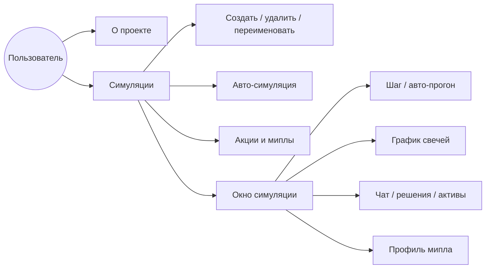
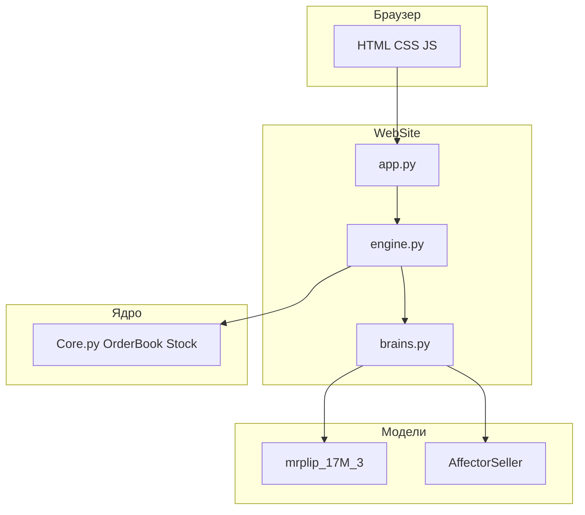
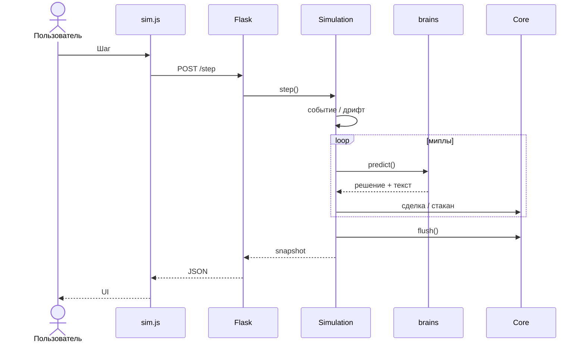

# UML-диаграммы проекта «Мипл»

Файлы `.puml` — для [PlantUML](https://www.plantuml.com/plantuml/uml/) (онлайн или плагин в IDE).  
Вставь в диплом как **Приложение А** (экспорт в PNG/SVG).

| Файл | Диаграмма |
|------|-----------|
| `01_use_case.puml` | Варианты использования (что делает пользователь) |
| `02_components.puml` | Компоненты системы |
| `03_classes.puml` | Классы ядра и движка |
| `04_sequence_step.puml` | Последовательность одного шага симуляции |

## Как получить картинку

1. Открой https://www.plantuml.com/plantuml/uml/
2. Скопируй содержимое `.puml` → Submit
3. Сохрани PNG → в Word «Вставка → Рисунок»

Или в VS Code: расширение **PlantUML** → `Alt+D` предпросмотр.

---

## Mermaid (для просмотра в Cursor / GitHub)

### Варианты использования (упрощённо)

### Компоненты

### Шаг симуляции

